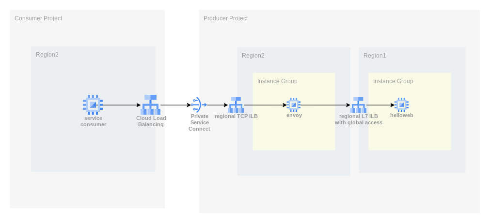

# terraform-psc-global

As a hack since Private Service Connect doesn't support global access, i made my own crude global access from the producer project using envoy proxies to forward tcp traffic to my real backend service in another region.

We also used the GCP Public CA to get a cert (since managed certs aren't supported for regional ILBs yet).  If you're running this terraform yourself, look at [these docs](https://cloud.google.com/certificate-manager/docs/public-ca-tutorial#request-key-hmac) to generate yourself acme credentials.

Thanks for reading.
